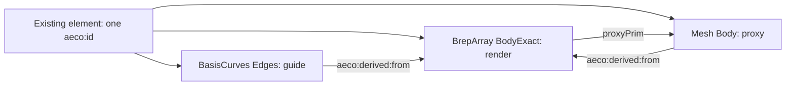

# Exact exported bodies in USD

## 1 The problem

A coordination mesh is a picture sampled at a chosen deflection. A 5 mm gap
cannot be decided from two meshes whose combined uncertainty is 6 mm.
An exact exported solid retains the analytic surfaces and topology needed
for a kernel distance calculation. Coordinators can distinguish a clearance
from an unresolved mesh measurement without returning to the authoring tool.

## 2 The data as it arrives

IfcOpenShell 0.8.5 evaluates IFC representation items, openings and placements.
Its SERIALIZED output is OCCT BRep text (the supported spelling of the former
USE_BREP_DATA route). The optional IFC command copies that text and its style
records into a temporary exchange, then launches the bridge's native runtime.
The default mesh converter is unchanged.

The example generates its IFC from the pinned data-centre specification in
this checkout's ignored work directory. The published USD is the composition
source. No sibling checkout is modified. Source counts are read from
`dc.manifest.json`; the office subset is counted from the published bodies.

## 3 The model in USD

Core's `AecoDerivedGeometryAPI` marks all three representations. `BodyExact`
uses `approx = exact`, a producer/content stamp and the maximum tolerance
reported by the source and rebuilt kernel shapes. `Body` uses
`approx = tessellated` and a stated linear deflection. A source fingerprint
in the twin's stamp detects older derivations after exact geometry or its
producer stamp changes; it does not use filesystem modification times.

The exact layer and the twin layer are independent. `fallbackPrimTypes`
maps BrepArray to Xform and preserves all core fallbacks. Mapped IFC products
share abstract USD representation prototypes through internal instanceable
references. Identity, placement and source correlation remain occurrence-local.
Canonical face subsets bind materials on both exact and tessellated bodies.

## 4 Workflow

1. Convert IFC normally, or open the published data-centre USD.
2. Run `aeco-ifc-exact input.ifc --stage model.usda --out exact` in the IFC
   integration. Use `--scope` or a JSON `--ids` selection when required.
3. Compose `exact/exact.usda` and `exact/twins.usda` above the model. Preserve
   the model's metre units, Z-up metadata and fallback types on the root.
4. Run `aeco-solid measure composed.usda`. Volume and area use the kernel;
   thickness selects the separation of the dominant parallel planar faces;
   outside diameter is twice the largest cylindrical-face radius.
5. Run `aeco-solid tessellate composed.usda --out retessellated.usda
   --deflection 0.0001 --edges`, then compose that overlay above the stage.
6. Run `aeco-solid compare composed.usda` and the UsdValidation profile.

Source-checkout commands and environment variables are in the README.
Measurements account for rigid placements and uniform scales. Nonuniform
scale and shear are rejected explicitly. Dimensions are candidates for
prismatic walls and round pipes; arbitrary multi-chamber or tapered shapes
need a more specific measurement definition.

## 5 Validation

| Rule | Severity | Defect |
|---|---|---|
| ExactBodyWithoutTolerance | error | exact body has no positive finite tolerance |
| TwinWithoutFrom | error | proxy twin omits or misdirects its source relationship |
| TwinStale | error | twin fingerprint predates changed exact content or stamp |
| ExactBodyNotSolid | error | bridge Build fails, IsValid is false, or SolidCount is zero |
| ProxyTwinMissing | error | exact body has no linked proxy Mesh with points |

Names are `usdAecoSolidValidators:<Rule>Checker`. Every rule has a healthy
baseline and a seeded defect. The gate also loads all core validators and
fails if their Python module cannot be imported. The native UsdSolid
validators are run on the example as a separate check.

Comparison uses explicit engineering budgets, not a kernel Hausdorff proof.
For deflection d, exact volume V and area A, the volume budget is d*A and the
area budget is d*A/L, where L=3*V/A. Both absolute differences must fit.
These dimensioned budgets are conservative acceptance criteria for this
fixture; they do not establish a universal bound for arbitrary surfaces.
The mesh's original deflection remains the declared positional uncertainty.

## 6 The example on the demo data centre

Variant `clash`, release v0.4.8, has 2,980 elements and 3,015 meshes. The office
cohort is every element with a body whose world bounding-box midpoint lies
within the office footprint from `spec/facility.yaml`, including its boundary.
This selects both floors and their boundary elements: 109 products across
17 IFC classes, including 42 walls, 6 pipes, 13 doors and 4 slabs.

The native export gives 109/109 valid solids. Wall section thickness agrees
within 2.83e-15 m and pipe OD agrees exactly with the source section values;
all 109 twin volume and area differences fit the stated budgets. Seven
mapped products share two representation prototypes. There are 214 exact
material subsets and 214 corresponding mesh subsets.

The three source-manifest cases measure: a hard intersection with common
volume 0.00042836676119217495 m³, a 0.005000000000000782 m clearance, and a
zero-distance tangent with zero common volume. Wireframe renders show these
bodies over their twins; the clearance close-up carries a USD stroke label
with the measured 5.000 mm value.

`run.py --publish` writes the flattened crate, own layers and stock USD render.
The B7 drill mutes the exact layer, checks unchanged points and transforms
for all 109 twins, and renders the resulting cutaway without plugins.
The presentation layer hides other geometry for the close-ups; muting that
layer restores the complete source and all office representations.

## 7 Trade-offs and alternatives

Route K keeps drivers, lets the authoring kernel solve joins and openings,
and returns a tessellation. It supports the existing editing workflow.
Route S exports the evaluated result into USD and permits independent
measurement, exact Boolean operations and consumer-chosen tessellation.
It adds native runtime dependencies, larger geometry data and kernel work.
Both routes use the same identity and derived-representation seam.

The 5 mm example is inside the source manifest's combined 6 mm mesh band.
This repository proves the exact distance; reproducing both clash engines'
classification report belongs to the clash library. It does not infer a
false mesh penetration from the exact result.

## 8 Out of scope and open questions

Driver-to-solid evaluation, exact geometry read-back through sync, direct
exact rendering and arbitrary CAD editing are deferred. No new family
geometry class, kind token or identity scheme is introduced.

The pinned fixture gives walls a single material and Qto Width, not an IFC
material-layer set. That width is the same input Route K turns into a
one-layer build-up. Pipe OD is supplied by DC_Section rather than a complete
IFC type schedule. Compound build-up and type-schedule equivalence are not
proven by this fixture. The exporter does support native material-layer
sets when they exist; it reports unsupported style/item correspondence.

## 9 Status

Version 0.1.5. The [public re-pin verification](public-repin.md) records current
pins and native-runtime limits. The publisher recreates mapped instances in sorted occurrence
order before flattening, preserving their sharing and composed geometry.
The gate publishes once from scratch and re-flattens the same authored layers
in a second process and root using the family's unchanged crate normalization.
It reuses that fresh publication for validation and result parity.
Fresh previews default to 8 samples per pixel; the declared budget is 120 s. See [acceptance](acceptance.md)
for gate totals and deviations.
The skeleton was generated with toolchain v0.3.2. Its local-schema-only lint
rules are inapplicable because Route S deliberately owns no schema; explicit
core applicability, registry and validator tests cover the consumed contract.
The frozen core mark's metadata attributes are not themselves flagged
`aecoDerived`; this package introduces no new semantic derived attribute and
authors only separate result layers. No core checkout is changed.

Guide images select the legacy Embree delegate because the scene-index path
reports dirty unknown exact prims with guides enabled. The pictured cutaway
contains no mapped occurrences. Stock proxy publication and its B7 render use
the default imaging path; guide rendering of mapped occurrences is not proven.
