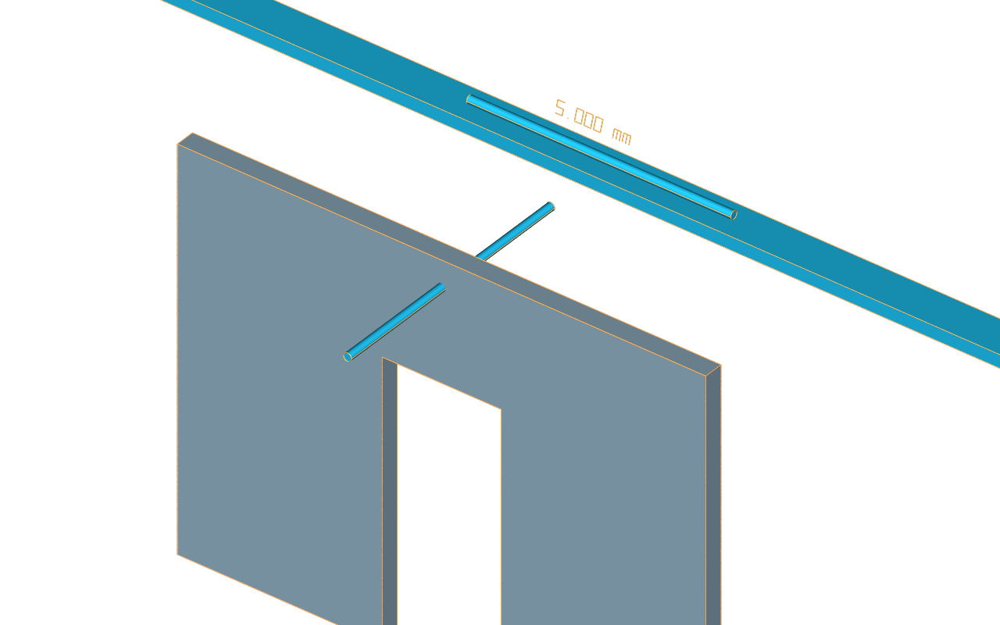

# Overview

Route S retains exact exported geometry alongside a stock USD Mesh twin.
It uses UsdSolid and the core derived-geometry mark, with no local schema.
The [minimal wall and pipe](../examples/minimal.usda) illustrate the anatomy.

`BodyExact` has render purpose; `Body` has proxy purpose and links its source
through `aeco:derived:from`. `Edges` has guide purpose. Enable guides to see
canonical edge curves over the tessellation. The mesh remains available when
the exact layer is muted or UsdSolid is not installed.

The [walkthrough](../../docs/usecase.md) explains measurement, comparison
budgets, validators and the pinned data-centre example.
